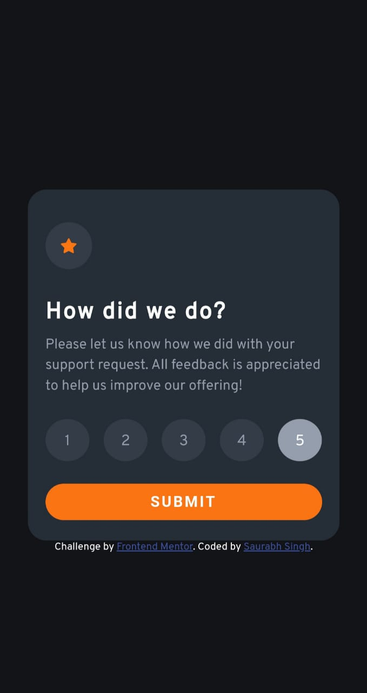

# Frontend Mentor - Interactive rating component solution

This is a solution to the [Interactive rating component challenge on Frontend Mentor](https://www.frontendmentor.io/challenges/interactive-rating-component-koxpeBUmI). Frontend Mentor challenges help you improve your coding skills by building realistic projects. 

## Table of contents

- [Overview](#overview)
  - [The challenge](#the-challenge)
  - [Screenshot](#screenshot)
  - [Links](#links)
- [My process](#my-process)
  - [Built with](#built-with)
  - [What I learned](#what-i-learned)
- [Author](#author)

## Overview

### The challenge

Users should be able to:

- View the optimal layout for the app depending on their device's screen size
- See hover states for all interactive elements on the page
- Select and submit a number rating
- See the "Thank you" card state after submitting a rating

### Screenshot

### Links 

Live Site URL: [Interactive-rating-component-main](https://saurabhisdev.github.io/Interactive-rating-component-main/)

## My process

### Built with

- HTML5 markup
- CSS
- Flexbox
- CSS Grid
- Vanilla JavaScript

### What I learned

Brushed up my CSS and JavaScript skills.

## Author

- Name - Saurabh Singh
- Frontend Mentor - [@saurabhisdev](https://www.frontendmentor.io/profile/saurabhisdev)
- Twitter - [@saurabh_twt](https://www.twitter.com/saurabh__twt)

